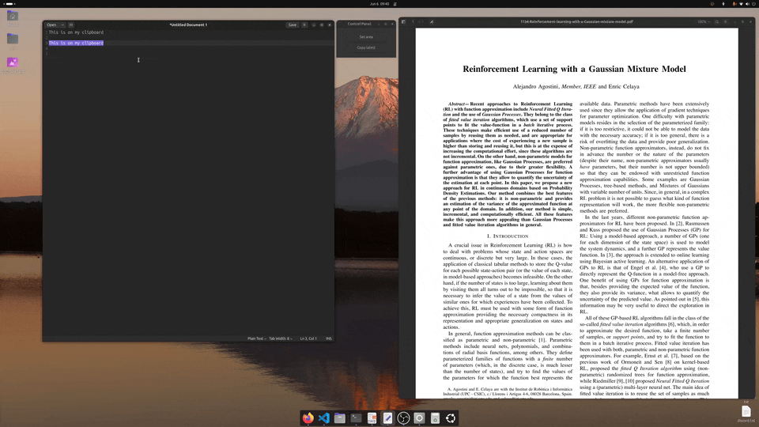

# ScreenshotToText

A simple utility to take a screenshot, select an area, and copy the detected text to your clipboard using OCR.

### Features ✨
1. Take a full-screen screenshot with a single command
1. Select a region of interest with your mouse
1. Detect and extract text from the selected area (OCR)
1. Copy the extracted text directly to your clipboard

### Demo ✨
